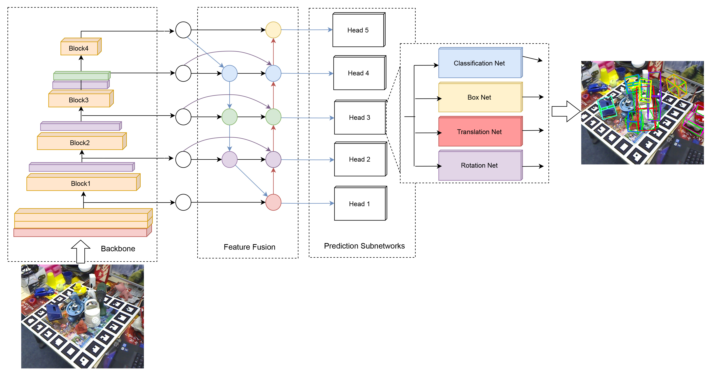

# SMO-6DPose
A deep learning model of 6D pose estimation for single and multi objects



## Getting Started

### Datasets
You can download the dataset from [here](https://drive.google.com/file/d/13oki4nUEp3z_6Sl4NovhldB90HZ1w1c-/view?usp=drive_link)

### Preparation
Please clone the repository locally:
```
git clone https://github.com/Metwalli/SMO-6DPose.git
```
Install the requirements:
```
cd SMO-6DPose
pip install -r requirements.txt
```

### Training 
To train the model:
```
python train.py --phi 0,1,2 --weights weights/model.h5 dataset(occlusion or linemod) /path-to-dataset
```
### Evaluating
```
python evaluate.py --phi 0,1,2 --weights weights/model.h5 dataset(occlusion or linemod) /path-to-dataset
```